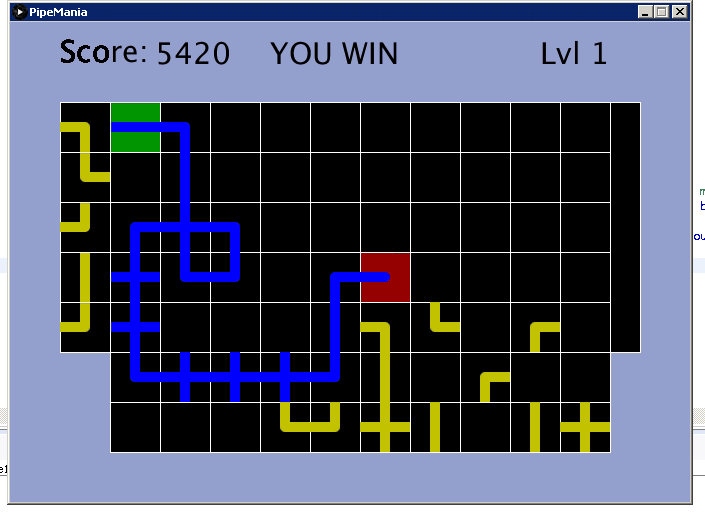
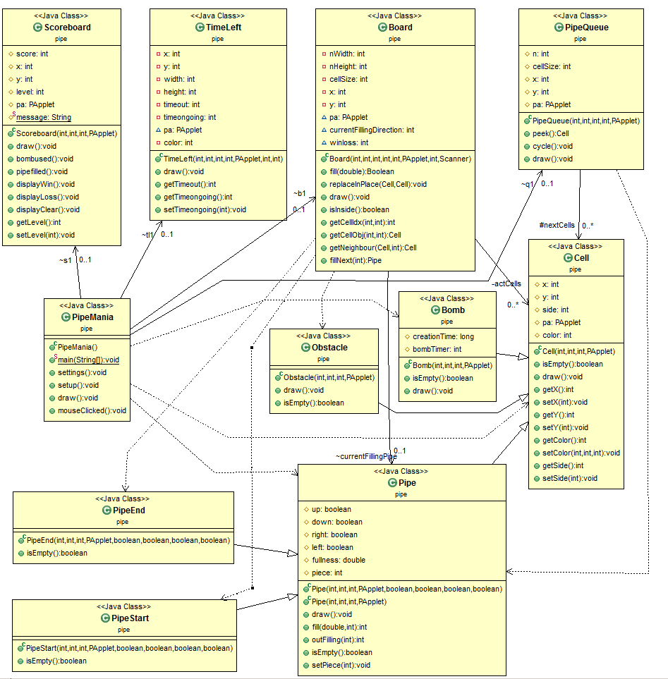

**PIPEMANIA**




**-TRABALHO PRÁTICO-**

```
Fred Fernandes
Rui Filipe
```


## CONTEÚDO

- 1 INTRODUÇÃO
- 2 METODOLOGIA
- 2.1 Descrição do Trabalho
- 2.1.1 BOARD
- 2.1.2 BOMB
- 2.1.3 CELL
- 2.1.4 OBSTACLE
- 2.1.5 PIPE
- 2.1.6 PIPESTART
- 2.2 PIPEEND
- 2.2.1 PIPEMANIA
- 2.2.2 PIPEQUEUE
- 2.2.3 SCOREBOARD
- 2.2.4 TimeLeft
- 2.3 Diagrama UML
- 3 DISCUSSÃO
- 4 CONCLUSÃO


```
2
```
## 1 INTRODUÇÃO

```
O presente trabalho prático consiste em implementar o videojogo PipeMania,
utilizando vários conceitos adquiridos ao longo das aulas, tais como a abstração, encapsu-
lamento e herança, entre outros, assim como o Processing, de modo a poder representar
graficamente os diferentes objectos do jogo.
```
```
Durante o presente trabalho prático utilizámos vários conceitos adquiridos ao longo
das aulas, como herança, encapsulamento, colecções, entre outros.
Fomos também aprendendo ao longo do desenvolvimento a utilizar o Processing,
que utilizámos em conjunto com o Eclipse.
```

```
3
```
## 2 METODOLOGIA


Decidimos desenvolver o jogo _PipeMania_ através de várias classes e subclasses,
sendo elas:

- Board - classe onde criamos a game board e tem várias verificações sobre o estado
    do jogo;
- Bomb - classe que nos permite criar uma bomba, de modo a podermos destruir peças
    criadas pelo jogador na board;
- Cell - classe importante que nos permite desenhar as várias células da game board;
- Obstacle - subclasse de Cell, utilizada para criar obstáculos indestrutíveis e imutáveis
    pelo jogador;
- Pipe - subclasse de Cell, utilizada de modo a permitir ao utilizador colocar novas
    peças na board;
- PipeStart e PipeEnd - subclasses de Pipe que têm como propósito criar os blocos
    que dão início e término ao jogo, respectivamente e são indestrutíveis e imutáveis;
- PipeMania - classe principal que é utilizada para criar a janela do jogo e instanciar
    as restantes classes;
- PipeQueue - classe que define a fila de blocos utilizados pelo jogador;
- Scoreboard - classe utilizada para mostrar a pontuação do jogador, assim como as
    mensagens de vitória e derrota;
- TimeLeft - classe que cria um temporizador até a água começar a correr;

## 2.1 Descrição do Trabalho

Decidimos implementar o _Processing_ no _Eclipse_ , e para tal tivemos que definir
3 funções oriundas do Processing, de modo a que este funcione correctamente, sendo
elas: **settings()** , onde definimos que a janela criada seria de 680x480 px, **setup()** , onde
definimos a cor do background, criamos a game board, a fila de peças a utilizar, o
temporizador e o scoreboard e finalmente a função **draw()** , onde desenhamos todos os
elementos anteriormente mencionados.

Descobrimos logo à partida que para utilizar Processing com Eclipse temos que
utilizar um _external JAR_ para podermos importar a biblioteca gráfica do anterior. Tivemos
também que estender a classe _PApplet_ , de modo a podermos usar os diversos métodos
disponibilizados pelo Processing.


```
Capítulo 2. Metodologia 4
```
## 2.1.1 BOARD

A classe Board possui diversos atributos que têm como propósito criar uma _game
board_ e para tal recorremos a uma colecção do tipo HashMap<Integer, Cell> de modo
a mapear um índice inteiro a um objecto Cell, que utilizamos para criar as células da board.

```
É nesta classe que lemos um ficheiro com os dados necessários para a criação dos vários
níveis, como a posição dos obstáculos e dos blocos de início e fim, e temos vários métodos
para averiguar o progresso do jogador ao longo do jogo.
```
```
Métodos da classe Board:
```
- public Boolean fill(double waterRise): este método realiza as verificações necessárias
    para saber o estado das peças quando a água começa a correr (se a peça se encontra
    cheia ou vazia). Se esta se encontrar vazia, continua a enchê-la, caso contrário verifica
    se a próxima peça se encontra numa posição válida para começar a enchê-la. Se a
    próxima peça não estiver numa posição válida, o jogo termina. Se não, este processo
    ocorre até o jogo terminar, quer através de vitória ou derrota.
- public void replaceInPlace(Cell oldCell, Cell newCell): método utilizado para substi-
    tuir uma célula da board (ocupada ou não) por outra peça, ocupando a nova célula
    a mesma posição da anterior.
- public void draw(): método utilizado para desenhar as células que fazem parte da
    game board.
- public boolean isInside(): método que retorna um valor booleano (True ou False)
    dependendo da posição do rato (se a mesma se encontra sobre a zona de jogo ou não).
- public int getCellIdx(int ix, int iy): método para determinar o índice de uma peça a
    partir da posição do rato sobre a game board.
- public Cell getCellObj(int ix, int iy): método Getter que nos devolve um objecto
    genérico Cell dependendo da posição (x,y) na zona de jogo.
- public Cell getNeighbour(Cell c, int direction): método que nos devolve a peça
    vizinha de uma outra numa determinada direcção.


_Capítulo 2. Metodologia_ 5

- public Pipe fillNext(int currentFillinDirArg): método usado para determinar se a
    peça vizinha se encontra numa posição válida para o jogo progredir.

## 2.1.2 BOMB

Bomb é uma subclasse de Cell, cujo propósito é criar uma bomba que permite ao
jogador destruir uma peça previamente colocada numa determinada posição, de modo a
poder colocar uma nova em seu lugar.

```
Métodos da classe Bomb:
```
- public boolean isEmpty(): método que devolve um valor booleano (True ou False)
    dependendo se a bomba já explodiu ou não.
- public void draw(): método utilizado para desenhar a bomba e definir o tempo que a
    bomba demora a explodir.

## 2.1.3 CELL

A classe Cell é uma classe genérica utilizada para criar as células da zona de jogo e
os restantes objectos utilizados no jogo, como Pipe, Bomb, etc.

```
Métodos da classe Cell:
```
- public boolean isEmpty(): método que nos indica se uma célula se encontra ocupada
    ou não, através de um boolean (True ou False).
- public void draw(): método utilizado para desenhar as células do jogo.

## 2.1.4 OBSTACLE

Subclasse de Cell, a classe Obstacle serve para criarmos uma célula ocupada por
um obstáculo indestrutível e imutável pelo jogador ao longo do jogo.

```
Métodos da classe Obstacle:
```
- public void draw(): método para desenhar os obstáculos na game board.
- public boolean isEmpty(): método utilizado para tornar o obstáculo imutável e
    indestrutível ao nos devolver False.


_Capítulo 2. Metodologia_ 6

## 2.1.5 PIPE

Pipe é uma subclasse de Cell, cujo propósito é criar as diferentes peças utilizadas
pelo jogador.

Esta classe tem a particularidade de ter 2 construtores, um onde, para além de
introduzirmos as posições (x,y) e as dimensões do Pipe, introduzimos também as direcções
dos pipes, e o segundo construtor onde omitimos as direcções dos pipes e este constrói
peças com direcções aleatórias.

```
Métodos da classe Pipe:
```
- public void draw(): método utilizado para desenhar o Pipe.
- public int fill(double fillRate): método utilizado para encher os pipes com água onde
    introduzimos o ritmo de enchimento e, se estes se encontrarem cheios devolve 1, caso
    contrário devolve 0.
- public int outFilling(int direction): método utilizado para descobrir qual o sentido
    da água após esta entrar por um lado do pipe.
- public boolean isEmpty(): método que nos diz através de um booleano (True ou
    False) se um pipe contém água.
- public void setPiece(int piece): método utilizado para definir qual o tipo de pipe a
    ser colocado.

## 2.1.6 PIPESTART

Subclasse de Pipe, PipeStart é uma classe com o propósito de criar o Pipe que
inicia o jogo, que tem que ser indestrutível e imutável pelo jogador.

O seu único método é public boolean isEmpty() que retorna False de modo a tornar
o objecto indestrutível e imutável pelo jogador.


_Capítulo 2. Metodologia_ 7

## 2.2 PIPEEND

Subclasse de Pipe, idêntica à classe PipeStart com o mesmo método, mas neste caso
cria o Pipe final que termina o jogo. A necessidade de criar esta classe vem de conseguir
destinguir um Pipe normal do final. Neste caso distinguimos em código pelo nome da
classe.

## 2.2.1 PIPEMANIA

Classe principal do jogo, onde temos as várias funções do Processing como settings(),
setup() e draw(), e também onde inicializamos os vários objectos e definimos métodos que
nos permitem criar os objectos necessários para criar o jogo PipeMania.

Nesta classe definimos um timer através do uso de Threads que gere os eventos do
progresso do jogo e definimos uma função void mouseClicked() que permite ao jogador
colocar as peças na célula desejada, não permitindo colocar várias peças na mesma a não
ser que destrúa a peça que ocupava a posição desejada.

## 2.2.2 PIPEQUEUE

Classe que cria uma fila de peças Pipe para o jogador utilizar para progredir no
jogo.

```
Métodos da classe PipeQueue:
```
- public Cell peek(): método utilizado para fazer peek à colecção de células da queue.
- public void cycle(): método usado para mover a fila de peças que o jogador irá
    utilizar.
- public void draw(): método que desenha as peças na game board.

## 2.2.3 SCOREBOARD

Classe utilizada para mostrar o nível actual, a pontuação do jogador e mostrar as
mensagens de vitória ou derrota.

```
Métodos utilizados pela classe Scoreboard:
```
- public void draw(): método para desenhar o quadro de pontuação no jogo.
- public void bombUsed(): método que remove 20 pontos do jogador ao utilizar a
    bomba para remover alguma peça.
- public void pipeFilled(): método que soma 100 pontos à pontuação do jogador quando
    um pipe é enchido na sua totalidade.


_Capítulo 2. Metodologia_ 8

- public void displayWin(): método que apresenta a mensagem de vitória ao jogador.
- public void displayLoss(): método que apresenta a mensagem de derrota ao jogador;
- public void displayClear(): método que limpa as mensagens de final de jogo.

## 2.2.4 TimeLeft

Classe utilizada para desenhar o timer na área de jogo. Possui um método draw()
para desenhar o timer e actualizá-lo à medida que o jogo progride.

## 2.3 Diagrama UML

As relações no diagrama de classes lêem-se da seguinte forma: PipeMania tem 1
Board, 1 TimeLeft, 1 PipeQueue, 1 Scoreboard. A PipeQueue tem 1 ou mais Cells. A


_Capítulo 2. Metodologia_ 9

Board tem 1 ou mais Cells. Cell é superclasse de Pipe, Bomb e Obstacle. PipeEnd e
PipeStart são filhos de Pipe.


```
10
```
## 3 DISCUSSÃO

Tivemos como objectivo separar em cada classe os diferentes objectos do jogo e, no
caso dos pipes, utilizar genéricos e herança o máximo possível, de modo a reutilizar código
e criar um número mínimo de classes.

Tinhamos como objectivo desenhar cada segmento do pipe a encher progressiva-
mente mas optámos por enchê-lo todo com uma mudança de cor. O nosso método de
avançar com o jogo foi encher em cadeia o próximo pipe com água do anterior. Desta forma
verificámos que seria demasiado complexo determinar se o jogo acabou só pelo caminho
dos pipes, ou seja, antes da água chegar ao fim. No entanto conseguimos fazer com que
uma feature muito importante para o jogo funcionasse, que é fazer com que os Pipes de 4
entradas permitam que água atravesse por cima em duas vertentes. Ficámos satisfeitos em
cumprir a restrição de dar pontos por cada pipe cheio com água e retirar pontos por cada
pipe destruído. Analisando a forma como gerimos os eventos de jogo, com uma Thread
a funcionar como temporizador conseguimos separar a lógica de desenhar e a lógica do
jogo, estas correndo concorrentemente. Pensámos que correr lógica em cada frame nao
é desejável. Tentámos usar o conhecimento que adquirimos sobre colecções utilizando-as
quando possível. Poderíamos ter abstraído mais a construção da board a partir do ficheiro
de níveis.


```
11
```
## 4 CONCLUSÃO

```
Com este projecto, adquirimos a capacidade de planear e desenvolver um jogo
graficamente com Processing com base no paradigma da Programação Orientada a Objectos,
aplicando os conhecimentos ensinados ao longo das aulas de modo a chegar à versão final
do jogo com código conciso, reutilizável, flexível e sem redundância do mesmo.
```

